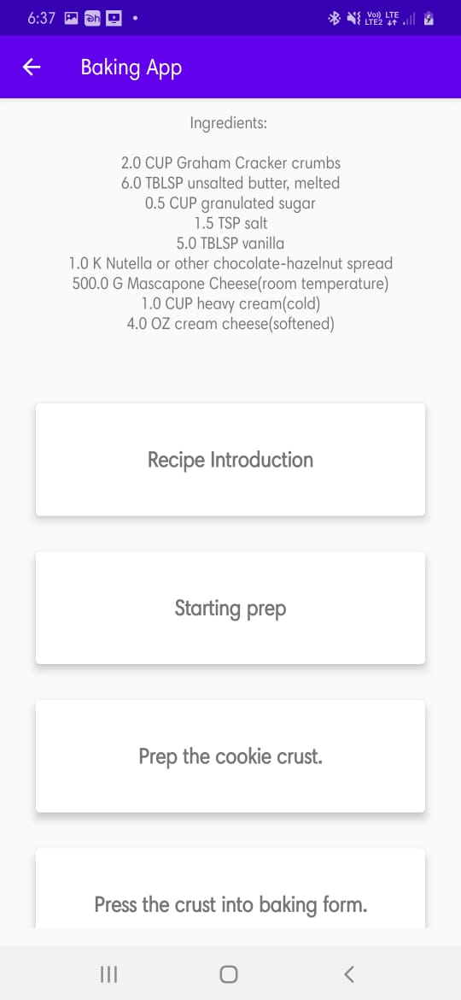

# Baking App
Baking app allow Udacity’s resident baker-in-chief, Miriam, to share her recipes with the world. The app allow a user to select a recipe and see video-guided steps for how to complete it.

## Why this Project?
As a working Android developer, you often have to create and implement apps where you are 
responsible for designing and planning the steps you need to take to create a production-ready app.
Unlike Popular Movies where we gave you an implementation guide, it will be up to you to figure things 
out for the Baking App.

## What I Learned

* Use MediaPlayer/Exoplayer to display videos.
* Handle error cases in Android.
* Add a widget to your app experience.
* Leverage a third-party library in your app.
* Use Fragments to create a responsive design that works on phones and tablets.

## Libraries
- [Android Architecture Components](https://developer.android.com/topic/libraries/architecture/) 
    * [Room](https://developer.android.com/topic/libraries/architecture/room)
    * [ViewModel](https://developer.android.com/topic/libraries/architecture/viewmodel)
    * [LiveData](https://developer.android.com/topic/libraries/architecture/livedata)
- [Android Data Binding](https://developer.android.com/topic/libraries/data-binding/)
- [Retrofit](http://square.github.io/retrofit/) for REST api communication
- [ExoPlayer](https://github.com/google/ExoPlayer) to play media locally and over the Internet
- [Picasso](http://square.github.io/picasso/) for image loading
- [OkHttp](http://square.github.io/okhttp/)

## Screenshots
 
 
